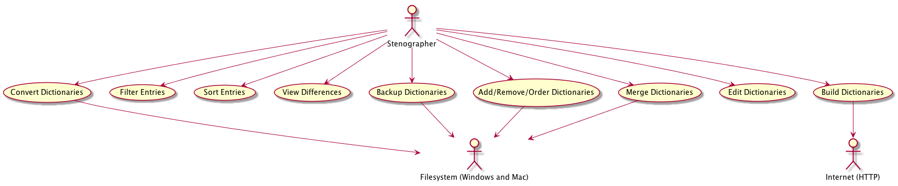

# Bozzy Analysis Report

## Table of Contents

- [Background](#background)
- [Requirements](#requirements)
  - [Functional Requirements](#functional-requirements)
  - [Non-Functional Requirements](#non-functional-requirements)
- [Example Data and Test Cases](#example-data-and-test-cases)
  - [Example Data](#example-data)
  - [Test Cases](#test-case)
    - [Add dictionary scenario](#add-dictionary-scenario)
    - [Convert dictionary scenario](#convert-dictionary-scenario)
    - [Edit Dictionary and See changes on save scenario](#edit-dictionary-and-see-changes-on-save-scenario)
- [Functional Features of System](#functional-features-of-system)
  - [Add, remove, and order dictionaries](#add-remove-and-order-dictionaries)
    - [Open a dictionary](#open-a-dictionary)
    - [Close a dictionary](#close-a-dictionary)
    - [Reorder dictionaries](#reorder-dictionaries)
  - [Filter entries](#filter-entries)
  - [Sort entries](#sort-entries)
  - [View differences](#view-differences)
  - [Convert dictionaries](#convert-dictionaries)
  - [Merge dictionaries](#merge-dictionaries)
  - [Backup dictionaries](#backup-dictionaries)
    - [Setting back up directories](#setting-back-up-directories)
    - [Performing a backup](#performing-a-backup)
  - [Build dictionary](#build-dictionary)
  - [Edit dictionaries](#edit-dictionaries)
    - [Add entry](#add-entry)
    - [Remove entry](#remove-entry)
    - [Edit entry](#edit-entry)
- [Non-functional features](#non-functional-features)
  - [Performance](#performance)
  - [Usability](#usability)
  - [Reliability](#reliability)
  - [Maintainability](#maintainability)
  - [Portability](#portability)
  - [Accessibility](#accessibility)
  - [Standards Compliance](#standards-compliance)
- [High Level Architecture](#high-level-architecture)
  - [User Interfaces](#user-interfaces)
  - [Scala Controllers](#scala-controllers)
  - [Data models](#data-models)
  - [Native file system](#native-file-system)
  - [Third-party Stenography Software](#third-party-stenography-software)
  - [Interactions](#interactions)
  - [Adding a dictionary](#adding-a-dictionary)
  - [Converting a dictionary](#converting-a-dictionary)
  - [Editing a dictionary](#editing-a-dictionary)
- [User interface mockup](#user-interface-mockup)
- [File Formats](#file-formats)
- [Algorithms](#algorithms)
  - [Conversion script](#conversion-script)
  - [Priority algorithm](#priority-algorithm)


## Background

This document is an analysis report for Bozzy, a stenographic dictionary editor. It is being built as the capstone project by a team of four students at the University of Ottawa. The objective of Bozzy is to make editing stenographic dictionaries easier. Plover, an open source stenographic program, uses a JSON dictionary format and right now there exists no way to convert it to and from the industry standard, RTF/CRE. We want to ease the conversion between JSON and RTF/CRE and allow users of Plover or proprietary stenography systems to edit their dictionaries for free. This document defines the requirements of Bozzy, and explains the plans that we have to address these requirements. This document aims to be the basis of our team's agreement with Mirabai Knight, the founder of Plover, who would like to use and distribute Bozzy when it is complete.

Generally, stenographers work with multiple dictionaries and need to make frequent manual back ups to ensure no valuable progress is lost. Stenography software works with a list of dictionaries, in a configurable order. When a stenographers makes chords on their steno machine, the software looks up in the stenographer's dictionaries to see what the definition is. Usually stenographers will have one large dictionary that is the base of their "theory" of writing, along with several smaller dictionaries that are composed of the stenographer's custom definitions, usually for job-specific terminology and custom briefs/shortcuts.

## Requirements

### Functional Requirements:

| Identifier | Requirement |
|-----------|--------------------------------------------------------------------|
|FR 1.1     |The system shall enable the user to open a dictionary.              |
|FR 1.2     |The system shall handle multiple open dictionaries at once.         |
|FR 1.3     |The system shall display all dictionaries' entries.                 |
|FR 1.4     |The system shall allow users to create a blank dictionary.         |
|FR 2.1     |The system shall allow the user to close a dictionary.             |
|FR 3.1     |The system shall order dictionaries by a priority.                   |
|FR 3.2     |The system shall allow the user to reorder the priority of dictionaries. |
|FR 3.3     |The system shall give new dictionaries the highest priority.        |
|FR 4.1     |The system shall calculate metadata for dictionary entries: stroke, translation, number of words, number of strokes, date added, hit count, is suffix, is prefix, number of alternative definitions, number of alternative strokes.
|FR 4.2     |The system shall allow users to filter entries by metadata.|
|FR 4.3     |The system shall allow users to sort entries by metadata.|
|FR 5.1     |The system shall allow users to edit the text content of strokes and translations for entries.|
|FR 5.2     |The system shall allow users to change the dictionary that an entry belongs to.|
|FR 5.3     |The system shall display changes which have been made to open dictionaries. |
|FR 5.4     |The system shall only write changes after user confirmation. |
|FR 6.1     |The system shall back up open dictionaries to a list of directories.|
|FR 6.2     |The system shall allow users to customize the list of back up directories.|
|FR 6.3     |The system must be able to restore from a backup.|
|FR 7.1     |The system shall convert RTF/CRE dictionaries to JSON.    |
|FR 7.2     |The system shall convert JSON dictionaries to RTF.      |
|FR 7.3     |The system shall list failures/ambiguities encountered during conversion.|
|FR 8.1     |The system shall allow users to merge dictionaries (of any format) with an ordered priority.|
|FR 8.2     |The system shall list failures/ambiguities encountered during merging.|
|FR 9.1     |The system shall accept a URL to load text from.                |
|FR 9.2     |The system shall accept text to process for dictionary building.      |
|FR 9.3     |The system shall scan text content for all words currently not in the dictionary.|
|FR 9.4     |The system shall allow users to interactively define strokes for new words.|

### Non-Functional Requirements

| Identifier | Requirement |
|------|--------------------------------------------------------------------------------------------------------------------------------------------------|
| NFR1 | The system must be able to load several thousand dictionary entries (less than 200,000) and display these entries in a table within 5 seconds. |
| NFR2 | The system must be usable for novice stenography users and shall take no longer than 1 hour to learn the core functionality of opening dictionaries, modifying them, and saving them.|
| NFR3 | The systems reliability for backing up each dictionary must be 99% at a later point in the products life cycle.|
| NFR4 | The system must be maintainable for future use in the Open Steno Project community.|
| NFR5 | The system must be expandable for future use in the Open Steno Project community.|
| NFR6 | The system must be portable on Windows and Mac operating systems.|                                                                                | NFR7 | The system must be accessible for users of screen readers.|
| NFR8 | The system must conform to the [RTF/CRE specification](http://www.legalxml.org/workgroups/substantive/transcripts/cre-spec.htm).|
| NFR9 | The system must be open source with a GPL v3 license.|
| NFR10 | The system must be responsive, reacting to user input within half a second.|

## Example Data and Test Cases

### Example Data

The data we will be using to test and verify the system are the following dictionaries:

#### `stened.rtf`

A dictionary provided by our customer in RTF format, which the Plover dictionary was originally converted from.

#### `magnum.rtf`

A proprietary dictionary that is sold online, which we have a copy of.

#### `main.json`

The Plover's main dictionary, an source dictionary in JSON format. This dictionary includes around 142,700 dictionary entries. Sample data of the first few entries:

```json
{
"#*E": "{>}{&e}",
"#*EU": "{>}{&i}",
"#*U": "{>}{&u}",
"#-D": "{^ed}",
"#-Z": "00",
"#240": "240",
"#45/TK-PL": "$45",
"#EUD/KWROPL": "idiom",
"#K*": "{>}{&k}",
"#KR*": "{>}{&c}",
"#KW*": "{>}{&q}",
"#KWR*": "{>}{&y}",
"#R*": "{>}{&r}",
"#W*": "{>}{&w}",
"*B": "B",
"*BG": "{^k}",
"*BGS": "action",
"*BS": "action",
"*D": "{^'d}",
"*E": "{>}{&e}",
"*E/KHREUPS": "Eclipse"
}
```

#### `commands.json`

Plover has "commands" to let the user interact with the system more like a real keyboard, with shortcuts and special keys. Because traditional steno software doesn't emulate a keyboard, this will be a large difference with potentially no conversion possible between JSON and RTF/CRE.

Some sample commands:

```json
{
"PW*FP": "{#BackSpace}",
"SR-RS": "{#Control_L(End)}{^}",
"STPH-B": "{#Down}{^}",
"TPEFBG": "{#Escape}",
"STPH-R": "{#Left}{^}",
"SKWRAURBGS": "{#Return}{#Return}{^}{-|}",
"R-R": "{#Return}{^}"
}
```

### Test Cases

#### Add dictionary scenario

**The user launches the application.**

- The main window appears.

**The user clicks the add dictionary icon from the main window.**

- The add dictionary window appears.

**The user clicks browse in the add dictionary window.**

- The file directory window appears.

**The user navigates through the file directory and selects the plover default dictionary `main.json` from files.**

- The directory for `main.json` file is shown in text box.

**The user clicks okay in the add dictionary window.**

- The table in the center pane of the main window is populated with all `main.json` entries:

| Stroke       | Translation | Words | Strokes |
|--------------|-------------|-------|---------|
| #*E          | {>}{&e}     | 1     | 1       |
| #*EU         | {>}{&i}     | 1     | 1       |
| #*U          | {>}{&u}     | 1     | 1       |
|      ...     |     ...     |  ...  |   ...   |
| PHOUPB/TAPBS | mountains   | 1     | 2       |
| PHOUPB/TEUPB | mountain    | 1     | 2       |
|      ...     |     ...     |  ...  |   ...   |
| WUT          | but         | 1     | 1       |
| WUZ          | was         | 1     | 1       |
| WUZ/KWREU    | wuzzy       | 1     | 2       |


#### Convert dictionary scenario

**The user selects `Manage > Convert` from menu.**

- The convert dictionary window appears.

**The user sets the following convert properties in the convert dictionary window.**

- Select dictionary to convert: `main.json`
- Converting to: `RTF`
- Output Location: `C:\Documents\Dictionaries`

**The users clicks convert in the convert dictionary window.**

- The file system window appears at the directory location of the converted dictionary

> `C:\Documents\Dictionaries\main.rtf`

#### Edit Dictionary and See changes on save scenario

**From the main window's center pane, the user selects an existing dictionary entry from the table**

- The entry becomes editable after selection

| Stroke       | Translation | Words | Strokes |
|--------------|-------------|-------|---------|
| PHOUPB/TAPBS | `mountains` | 1     | 2       |

**The user changes text 'mountains' to 'mountainous' and hits enter or clicks away from the dictionary entry**

- The entry is updated to the changed text

| Stroke       | Translation | Words | Strokes |
|--------------|-------------|-------|---------|
| PHOUPB/TAPBS |`mountainous`| 1     | 2       |

**The user selects `File > Save` from menu.**

- The Save window appears and the following information is displayed:

> Changes made since last save:
> - modified: main.json
> - + PHOUPB/TAPBS , mountainous,  1, 2
> - - PHOUPB/TAPBS , mountains,  1, 2

**The user clicks save**

- Changes are saved to dictionary.

## Functional Features of System

In the following use cases, we refer to the stenographer actor as user for brevity.

Here is an overview of the use cases and actors involved, expanded below:



### Add, remove, and order dictionaries.

Corresponds to function requirements 1.1, 1.2, 2.1, 3.1, 3.2

This is relevant to both the stenographer and interacting with the file system.

The stenographer will manage a list of open dictionaries, which are dictionaries
that they are interacting with. Therefore, they need to be able to add and
remove from this list by opening and closing dictionaries. Furthermore,
stenographic dictionaries have an explicit order, so the stenographer must be
able to reorder their steno dictionaries.

#### Open a dictionary

Actors: stenographer and file system

1. User clicks "add dictionary" button.
2. File select dialogue pops up, user selects one or more dictionaries to open.
3. User confirms selection.
4. Files are added to open dictionary list, contents are displayed in the main entry viewer.

##### Exception A
- 3A. User cancels selection.

##### Exception B
- 4B. Dictionaries files are invalid.
- 5B. Warn users of invalid dictionary file with clear error message.

#### Close a dictionary

Actor: stenographer

Prerequisite: user must have at least one dictionary open

1. User selects a dictionary from the list.
2. User selects "close dictionary" button.
3. Bozzy asks confirmation to close dictionary.
4. Dictionary is closed on confirmation accept.

##### Exception A

- 4A. Dictionary is not closed if user dismisses the confirmation.

#### Reorder dictionaries

Actor: stenographer

Prerequisite: user must have at least two dictionaries open

1. User selects a dictionary to reorder.
2. User selects "up" or "down" buttons to reorder dictionary up or down in the
list.
3. The dictionary moves one in priority, and the dictionary it replaces receives
the previous priority of the selected dictionary.

##### Exception A

- 3A. If the dictionary is already top priority, the "up" button will have no effect,
if the dictionary is already lowest priority, the "down" button will have no effect.

### Filter entries

Actor: stenographer

Corresponds to functional requirements 4.1, 4.2

1. User enters filter criteria (stroke, translation, dictionary, hit count, number of words, number of strokes).
2. User clicks the "filter" buttons.
3. System displays results.

#### Exception A

- 3A. No results found, system displays a message to clarify that there are no results for the user's filter criteria.

### Sort entries

Actor: stenographer

Corresponds to functional requirements 4.1, 4.3

Prerequisites: the column that the user wants to sort by is visible

1. User clicks on column to sort by.
2. The system sorts the column, ascending.
3. User clicks on column to sort by a second time.
4. The system reverses the sorting order to descending.
5. User clicks on column to sort by a third time.
6. The system reverts to the default sorting order.

### View differences

Actor: stenographer

Corresponds to functional requirement 5.3.

Prerequisites: at least one stroke has been added or removed (a modified stroke would be both a removal and an addition).

1. The user opts to view differences (occurs on save, when trying to exit the application, or when clicking on the change indicator)
2. A dialogue pops up, showing the user the changes, including strokes added and removed, grouped by dictionary.

### Convert dictionaries

Actors: stenographer and file system

Corresponds to functional requirements 7.1, 7.2, 7.3

Prerequisites: the user has at least one dictionary open.

1. User selects to convert a dictionary.
2. User selects the dictionary to convert from a list.
3. The available file formats to convert to are listed, and the user selects one.
4. The converted dictionary name and directory are presented, and the user can use the file system picker to change it.
5. The user selects to convert.
6. The converted dictionary is not added to the list of open dictionaries.

#### Exception A

- 6A. The conversion had entries that were not supported. There is a list of dropped entries in the dialogue, and the dictionary was still created.

#### Exception B

- 6B. No entries were converted, the file was not created.

#### Exception C

- 6C. The selected output path is taken/doesn't exist, operation aborted.

### Merge dictionaries

Actors: stenographer and file system

Corresponds to functional requirements 8.1, 8.2.

Prerequisites: the user has at least two dictionaries open.

1. The user selects to merge dictionaries.
2. The user adds the dictionaries he wants to merge, and specifies priority order.
3. The user selects the file format and path of the merged dictionary.
4. The user starts the merge.
5. The merged file is created, and the user is notified of all priority dictionary overrides.

#### Exception A

- 5A. If there were dropped strokes due to format conversion issues, they are separately listed.

#### Exception B

- 5B. There was a file system error and no files were written.

### Backup dictionaries

Corresponds to functional requirements 6.1, 6.2, 6.3

#### Setting back up dictionaries

Actors: stenographer and file system

1. User selects backup menu.
2. User is presented with a list of backup directories, which can be removed and added to.

#### Performing a backup

Actors: stenographer and file system

Prerequisite: user has configured one or more backup directories.

1. User selects to perform a backup.
2. All open dictionaries are backed up to each backup directory, in a dated folder.
3. User is informed of backup success.

##### Exception A

- 3A. User is informed of file system error.

### Build dictionary

Actors: stenographer and HTTP

Corresponds to functional requirements 9.1, 9.2, 9.3, 9.4.

Prerequisites: user has at least one dictionary open to build.

1. User selects "build dictionary" option from menu.
2. User must present a URL or a block of text to use as a seed.
3. System presents user with words that are not defined in the user's dictionaries, from most to least common.
4. With each word, the user can optionally define strokes, then continue, or stop building.
5. There are no more words to define, the user is given a list of all added words and strokes.
6. Defined strokes are added to the highest priority dictionary, and changes are not saved (unless the user does so outside of this use case)

#### Exception A

- 5A. The user selected stop building, and is presented with the final screen with a summary of the changes.

### Edit dictionaries

Corresponds to functional requirements 5.1, 5.2, 5.3, 5.4.

Prerequisites: the user must have at least one dictionary open.

#### Add Entry

Actor: stenographer

1. The user can add an entry.
2. A table row is inserted, and the user must fill in at least the stroke, translation, and dictionary (file) fields.
3. New entry is created.

##### Exception A

3A. New entry has a conflicting stroke field, the user is informed of the conflict, and given a chance to override, continue editing, or cancel the entry creation.

#### Remove Entry

Actor: stenographer

1. User selects an entry and selects delete.
2. Confirmation dialogue confirms user's intention.
3. User confirms, entry is removed.

##### Exception B

3A. User cancels, entry is not removed.

#### Edit Entry

Actor: stenographer

1. User double clicks on an entry's stroke, translation, or dictionary field.
2. The field becomes editable, and the user sets a new value.
3. On Enter or click away, the change applies.

##### Exception A

- 3A. The stroke conflicts with another entry. The user is given the option to override the other entry, continue editing the current entry, or cancel the change.

## Non-Functional Features

Each non-functional requirement includes a brief description as well an explanation of how we plan to design and build the system to address the requirement, and how we plan to verify that the requirement is met.

### Performance

#### NFR1: The system must be able to load several thousand dictionary entries (less than 200,000) and display these entries in a table within 5 seconds.

To address this requirement, we plan to design and build our system using Model View Controller pattern (MVC) with JavaFX collection of observable lists and table views. We will test and verify this requirement is met by doing manual tests of loading dictionaries and doing direct measurements of time. The largest dictionary we will use as our data to test and verify this requirement has roughly 140,000 dictionary entries, which is a very large number of entries compared to typical dictionaries.

#### NFR10: The system must be responsive, reacting to user input within half a second.

Whether the user sorts or filters on fields in the table such as translation, stroke, word count, or stroke count, or whether the user edits, removes, or adds dictionary entries, the system must not lag. To design and build the system to address this requirement, we plan to use good programming practices, and plan to optimize our algorithms while taking advantage of the efficiency of functional programming. To verify the requirement is met, we will set up automated tests simulating all forms of user inputs mentioned previously, and then do direct measurements of the time for each test. We will also show loading indicators for long operations.

### Usability

#### NFR2: The system must be usable for novice stenography users and shall take no longer than 1 hour to learn the core functionality of opening dictionaries, modifying them, and saving them.

Learning stenography is often overwhelming for new users, and can continue to be challenging for experienced users. Thus the usability of the system is key to attract new users to stenography and to keep existing stenography users engaged. To address this requirement, we have done the following to make design decisions:

- For each system functionality, each team member brainstorms different UI design ideas, and later we compare ideas and pick or combine the best solution. Even after picking a solution, we continue to be critical of design decisions as our system grows.
- We take advantage of asking our customer for design ideas, since she has lots of experience with existing design implementations of stenography and dictionary applications, and always has interesting insight and ideas to offer to improve our design.

To test and verify our design, we've gathered both a small group of extremely experienced stenographers, as well as a large pool of stenographers with varying skills from the open steno project community who've agreed to interact with our system and provide feedback.

### Reliability

#### NFR3: The systems reliability for backing up each dictionary must be 99% at a later point in the products life cycle.

The system must copy and archive data to users computers in order to recover data after a data loss event, or to recover data from an earlier time. To design and build the system to address this requirement we will copy and archive data to at least 2 file locations every time there is a change made to the dictionary such as add, remove, and modify. To verify the requirement is met, we will use probabilistic measures, such as the model of failure represented by the exponential failure function. We know that the failure intensity is initially high as it would be in new software, since failures are detected more frequently during the testing phase. However, the number of failures would be expected to decrease with time during the operating phase, presumably as failures are uncovered and repaired. We also know that the more dictionaries a user is modifying at one time in the application, the worse the systems reliability becomes at one time.

#### Maintainability

#### NFR4: The system must be maintainable for future use in the Open Steno Project community.

One of the big issues in open source projects is lack of documentation, which discourages people from continuing work on a project since so much effort is needed to understand the application. To design and build the system to address this requirement, we've set up a GitHub repository to keep track of documentation, issues, pull requests, and commits, and included the use of a continuous integration service called Travis CI. We will also apply the MVC pattern to our system as a way of implementing separation of concerns. To verify the requirement is met, developers will keep track of whether the system is easy to repair using anecdotal observation of resources spent.

#### NFR5: The system must be expandable for future use in the Open Steno Project community.

This application must be expandable because after the capstone project, the application will be integrated into the Open Steno Project group who will maintain and continue expanding and adding features to the application. To design and build the system to address this requirement, we will use functional programming to and try to keep our implementations simple and readable with as little code necessary. We will also take into account design principles such as MVC, and use separation of concerns for each module. To verify the requirement is met, expandability will be measured in terms of compliance with open system standards.

### Portability

#### NFR6: The system must be portable on Windows and Mac operating systems.

Our application will have cross-platform support. We are committing to Windows and Mac since these are the two most common platforms our users use. It is really key that our application is portable, because if not it would mean we would be going backwards from dictionary editing solutions that already exist. To design and build the system to address this requirement and allow for cross-platform support, the application will be built to run in the JVM. To verify testing, we will commit to test on the latest Java 7 CPU update, which at the time of writing is Java 7u79. We will be developing and building in the latest JDK 8, unless for some reason there is some kind of incompatibility introduced into the JDK. Two of our team members will test and verify this requirement using laptops with Windows 7 OS installed, and our other two team members will test using laptops with Mac OS installed.

### Accessibility

#### NFR7: The system must be accessible for users of screen readers.

Some concerns that have been addressed about screen reader accessibility include whether or not graying out UI features will be readable on screen readers. To design and build the system to address this requirement, we will rely on our customers knowledge of screen readers. To verify the requirement is met, we will ensure that every time our customer interacts with the system, that they try and think of any reason our system would not be accessible for users of screen readers.

### Standards Compliance

#### NFR8: The system must conform to the [RTF/CRE specification](http://www.legalxml.org/workgroups/substantive/transcripts/cre-spec.htm).

The system must ensure that Plover's open source JSON dictionary format is interoperable with the industry standard of RTF/CRE, and thus must conform to the RTF/CRE specification. To design and build the system to address this requirement, we will read and implement the specification by enumerating the special symbols and offering a conversion between the RTF/CRE syntax and the Plover syntax. To verify the requirement is met, conformance will be measured in terms of compliance with RTF/CRE standards.

#### NFR9: The system must be open source with a GPL v3 license.

Our target users are part of an open source steno project community, and use existing open source software such as Plover, a stenography application. Thus to design and build the system to address this requirement, we will include the license and ensure we are not infringing on it, and we will ensure not to include non-compatible libraries. To verify the requirement is met, the system will be measured against it's compliance with open source standards.


## High Level Architecture


Bozzy's overall architecture is best described as a version of the Model View Controller architectural pattern. Bozzy is a standalone desktop application, and the MVC pattern applies quite nicely, and makes it rather trivial to maintain a modularity and separation of concerns within the application.

### User Interface

The user interface will be built using JavaFX and FXML for a modular component-based view layer. Its main role is to enable the user to cleanly view the contents of the user's stenography dictionaries, and access Bozzy's core functions to perform dictionary management tasks. The use of JavaFX for the user interface introduces a dependency to Java and the JVM, though it also enables a the possibility for a seamless experience across multiple operating systems. The user interface will not be modifying the data models directly and will instead communicate with the controllers to perform any actions. Similarly, it should not be getting any core data from the controller, and instead will display information found in the corresponding data model.

### Scala Controllers

The controllers are to be written using Scala. These are what the user (through the user interface) to actually manage and edit their stenography dictionaries.

### Data Models

Data models are used to hold the current dictionary, user settings, and any other data in memory. Keeping the data layer separate from the application logic and views user views makes everything much easier to reason about. It also makes it easier to optimize the data structures as needed, and modify the underlying data schemas without needing to change the way the application uses it.

### Native File System

Bozzy needs to use the operating system's native file system to read and write dictionary files, as well as user settings files. The dictionary files will be stored in JSON as well as RTF/CRE format. The user setting will be stored in a single file in the YAML format in order to make it possible to back up/export/share settings between different installations.

### Third-party Stenography Software

The system will be interacting with and modifying dictionary files from third-party stenography software but will not be interacting directly with the software itself.

### Interactions

The following interaction diagrams illustrate how the different components interact in the main scenarios.

#### Adding a Dictionary


#### Converting a Dictionary


#### Editing a Dictionary Entry


## User Interface Mockup (2-3 pages)


Screenshot 1: This is first page which will be shown when the application is opened


Screenshot 2: When clicking the "+" icon in the dictionaries panel of the main screen, this Add Dictionary dialog is shown


Screenshot 3: This shows the default Plover dictionary open in Bozzy


Screenshot 4: To convert a dictionary, an action is found under the "Manage" menu


Screenshot 5: The user is presented with a few options for converting a dictionary's format


Screenshot 6: Editing a dictionary entry is simple and can be done inline by double-clicking on an entry

## File Formats (1 page)

First, the actual dictionaries managed by Bozzy can be stored in both RTF/CRE format as well as a flat JSON file.

The JSON format is quite simple as it is a standard JSON format, with the restriction that there are no arrays or nested objects. The key represents the stroke (raw input), and the value is the translation (what it should be interpreted as). Here is an example of a simple dictionary, build from an excerpt of the default Plover dictionary:

```json
{
  "*ED": "Ed",
  "*ED/PHA/PHAEU": "edamame",
  "*ED/PHAPL/PHAEU": "edamame",
  "*ED/PHOPB/TO*PB": "Edmonton",
  "*ED/SO*PB": "Edison",
  "*ED/TKA": "Edda",
  "*ED/WARD": "Edward"
}
```

The RTF/CRE format is used by all proprietary stenography software for import/export. It is not as easily human readable as JSON. It also supports some additional fields to provide metadata information on a dictionary entry. Seeing as the JSON format doesn't support these extra fields, however, the conversion between the two formats will not take these into account. Here is an excerpt from a RTF/CRE dictionary:

```rtf
{\*\cxs PHOPB/OG/PHOUS}monogamous
{\*\cxs PRAO*UF/PWHREU}provably
{\*\cxs TKAB/-BLG}dabbling
{\*\cxs HRAEU/PERS/O*PB}layperson
{\*\cxs AEU/PAEL/-BL}appealable
{\*\cxs SREPB/TREUBG/-L}ventricle
{\*\cxs PW*EU/PART/SA*PB/SHEUP}bipartisanship`
```

Finally, some of the user settings will be saved in a single YAML file. This way, users will be able to back up their settings and copy them from one installation to another if needed. This would also allows us to potentially offer ways of backing up/sharing these settings easily.

## Algorithms

### Conversion script

We need to convert between two major formats as well as display both of them together seemlessly. Internally, we'll have to normalize both formats into objects that can both be used for various program interactions, and only on import/export will the file format really matter. For this, we need to inspect RTF/CRE and JSON spec and see where they do and do not intersect. This will be crucial in order to create meaningful conversion failures. It's important for users to know when a stroke wasn't converted due to a difference in the spec. For example, RTF/CRE has conflict strokes, which Plover JSON does not. Plover's JSON has symbols named after Xorg's key list, and RTF/CRE does not. We do not have a conversion algorithm yet, but we will need a processing to go through the conversion from both directions.

Effectively, we need an enumerated list of all of RTF/CRE's syntax, and their Plover equivalents. This should provide the common ground that we can use to convert between the two systems.

We do not have example data yet as we are not at this point in our application. It is a goal to have this example numerated out. There is already a conversion script by a previous Plover developer online who used pattern matching to convert between the two formats.

### Priority Algorithm

Bozzy will store dictionaries in an explicit order, and this order comes up often for stenographers. It's useful to know when a stroke is the priority one and when it isn't. Therefore, we need to hold whether the stroke is overriding another stroke, or if it is overridden. To do this, we will just look at common strokes between dictionaries, and then the highest priority dictionary will be the entry overriding others, and the other entries will be labeled as overridden.

This algorithm will also be used while merging dictionaries, where the highest priority dictionaries will always be first to have an entry in the merged dictionary over the lower priority dictionaries.

To solve this problem, we are going to use a list of dictionaries in order, and check in each one descending for the desired stroke. For merging, we are going to populate the merge with the lowest priority dictionary, and keep overriding with the higher priority dictionaries as they are being applied.


--------------------
